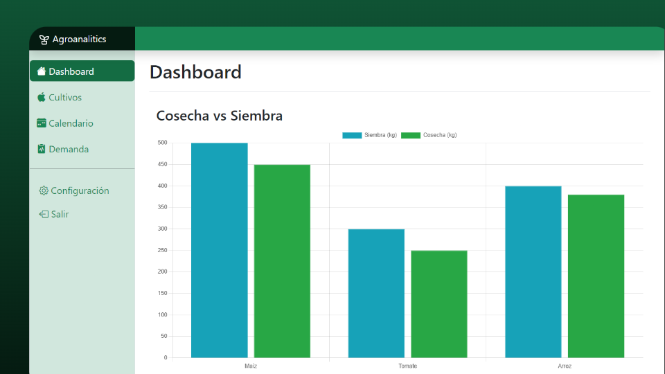
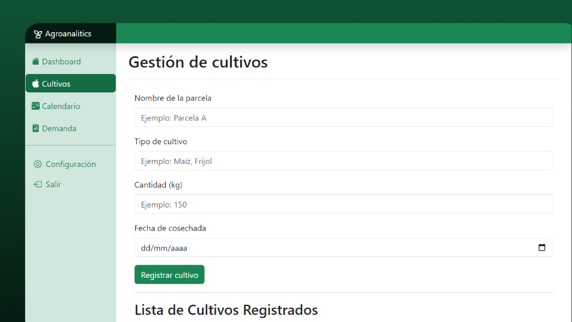
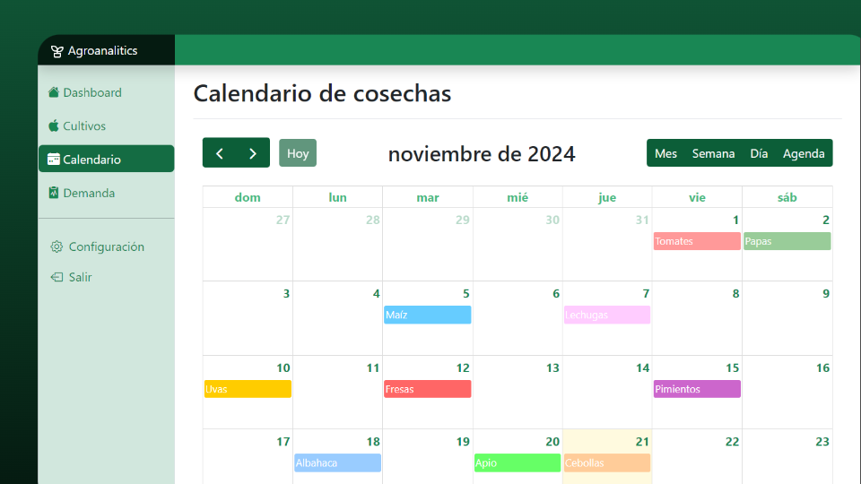
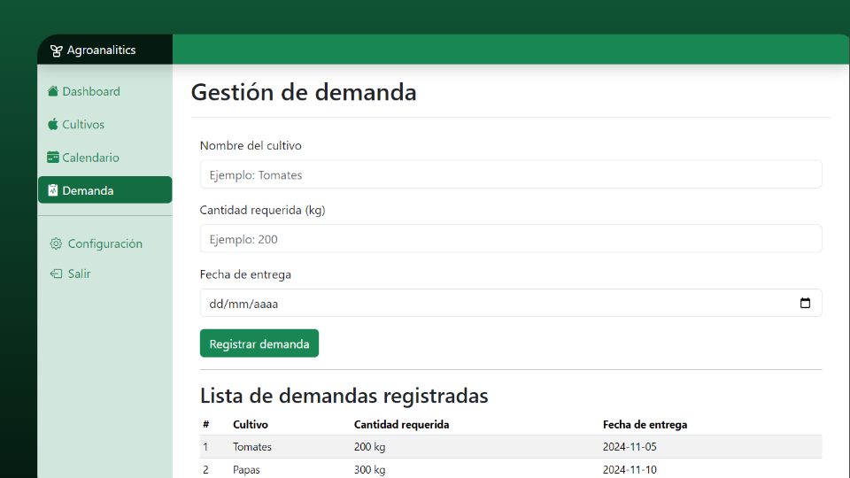

# agroanalitics
En AgroAnalytics, creemos que el futuro de la agricultura está en la inteligencia y la sostenibilidad. Nuestra plataforma avanzada utiliza análisis de datos y tecnología de vanguardia para optimizar cada aspecto del proceso agrícola, desde la siembra hasta la cosecha.

